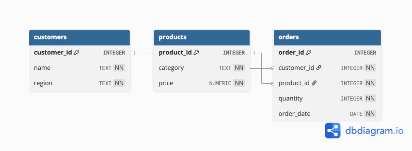

# E-Commerce Analytics Database (PostgreSQL)

A simplified relational database project for analyzing e-commerce operations.  
Designed as a portfolio project to demonstrate SQL proficiency, including:  

- Joins (inner, left, self)  
- Subqueries & common table expressions (CTEs)  
- Aggregate functions (COUNT, SUM, AVG, etc.)  
- Window functions (ROW_NUMBER, RANK, etc.)  
- ER diagram design & schema creation

---

## Repo Structure  

<pre>
E-Commerce-Analytics-Database/
│
├── queries/ # Ready-to-run example SQL queries
│ ├── 01_customer_orders.sql
│ ├── 02_sales_by_region.sql
│ ├── 03_product_performance.sql
│ ├── 04_repeat_customers.sql
│ └── ...
│
├── DATA/ # Full database schema with seed data
│ ├── schema.sql 
│ └── seed_data.sql
│
└── E-commerce_analytics_er_diagram.png # Entity-relationship diagram (dbdiagram.io)
</pre>

---

## Database Design  

**Entities:**  
- **Customers** – customer_id, name, region 
- **Products** – product_id, category, price   
- **Orders** – order_id, customer_id, product, quantity, order_date

**Relationships:**  
- Order → product_id (category)
- Order → customer_id (to access information like name and region)




---

## Example queries 

### 1. Most revenue by region

```sql
SELECT c.region, 
	SUM(p.price * o.quantity) AS revenue
FROM orders o
JOIN customers c ON o.customer_id = c.customer_id
JOIN products p ON p.product_id = o.product_id
GROUP BY c.region
ORDER BY revenue DESC;
```
> This query calculates total revenue by customer region. It joins `orders` to `customers` to get each
> order’s `region`, and to `products` to get each product’s `price`. For every region, it sums `p.price` *
> `o.quantity` to compute revenue, groups by `c.region`, and then sorts the results from highest to lowest
> revenue.

### 2. Customers with order in only one category 

```sql
-- Show customers with order in only one category 

WITH per_customer AS ( -- CTE to count distinct category orders for each customer 
	SELECT o.customer_id, 
		COUNT(DISTINCT p.category) AS cat_cnt
	FROM orders o
	JOIN products p ON p.product_id = o.product_id
	GROUP BY o.customer_id
)

SELECT c.customer_id, c.name, c.region
FROM per_customer pc
JOIN customers c ON c.customer_id = pc.customer_id
WHERE pc.cat_cnt = 1
ORDER BY c.customer_id;
```
> It first uses a CTE (`per_customer`) to count the number of distinct product categories each customer
> has ordered from by joining `orders` with `products`. Then, in the main query, it joins this result with the
> `customers` table and filters with `pc.cat_cnt = 1`, meaning only customers who ordered from a single
> category are returned. Finally, it outputs each customer’s ID, name, and region, ordered by customer_id.

---

## Project goals 

- Demonstrate SQL proficiency for **data analytics internships**
- Provide a **extendable base** for building advanced analytics features
- Practice with **realistic** business-oriented queries

---

## Author 

**Kanstantsin Nechyparenka** 
<pre>
Email: 
nklimfet@gmail.com (for personal inquiries, collaboration ideas and any questions)
nechypak@oregonstate.edu (Oregon State University) 
</pre>


